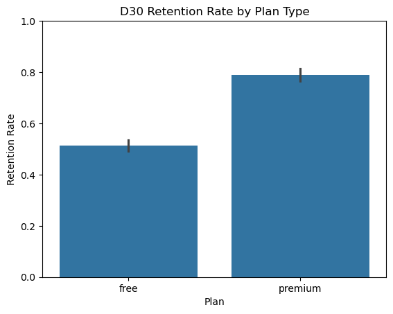
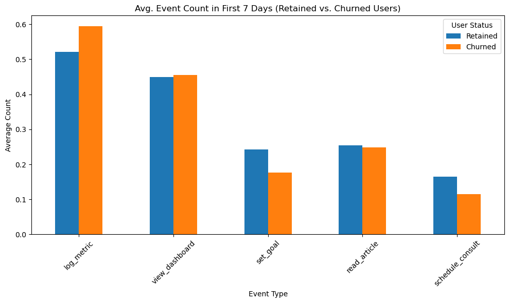

# user-retention-analysis

# Predicting User Retention in a Healthcare SaaS  

## Overview

This project simulates and analyzes behavioral data from a fictional healthcare SaaS product.

This SaaS app helps users manage chronic conditions (e.g., hypertension, diabetes) by enabling them to:
- Log health metrics
- Set personal health goals
- View progress dashboards
- Access educational resources
- Book consultations with medical professionals

## Research Question

> **“Which user behaviors in the first 7 days best predict long-term retention?”**

---

## Objectives

- Simulate a realistic event log for thousands of users over a 45-day period
- Define and calculate key product metrics (D7 and D30 retention)
- Build behavior-based features from first-week usage
- Visualize differences in behavior between retained and churned users
- Provide actionable recommendations for product improvement

---

## Folder Structure

```text
/user-retention-analysis/
├── code/
│   └── generate_data.ipynb
├── data/
│   ├── users.csv
│   ├── events.csv
├── visualisations/
│   ├── retention_by_plan.png
│   ├── behavior_by_event_type.png
├── README.md
```

## Insights into data

### D30 Retention by Plan Type



> **Premium users had ~30% higher D30 retention than free users.**

### Behavioral Patterns: Retained vs. Churned Users



> **Goal-setting and scheduling a consult strongly correlate with long-term retention.**

---

## SQL-Based Product KPIs

In addition to exploratory analysis in Python, this project includes a full SQL pipeline to analyze key product metrics and user behavior using a simulated PostgreSQL database.

See `sql/retention_kpis.sql` for all queries. Includes:

| Query | Description |
|-------|-------------|
| **Retention Flags** | D7 and D30 retention calculated per user |
| **Activation Funnel** | Tracks how many users completed key early actions |
| **Feature Adoption** | Compares usage across `free` and `premium` plans |
| **Cohort Retention** | Tracks retention by signup month |
| **Engagement Metrics** | Identifies power users by event frequency and diversity |

These queries were run and tested in **pgAdmin 4** with data imported from the generated `users.csv` and `events.csv`.
For more, please refer to: [`sql/README.md`](sql/README.md)

